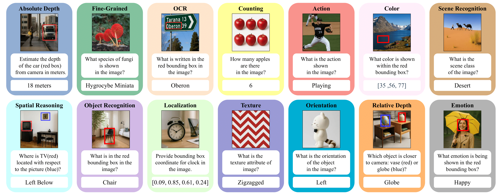

<h2 align="center"> <a href="https://arxiv.org/abs/2506.09082">🔍 AVA-Bench: Atomic Visual Ability Benchmark for Vision Foundation Models (CVPR 2026)</a><h5 align="center">

[](https://huggingface.co/datasets/act13/AVA-Bench) [](https://arxiv.org/abs/2506.09082) [](https://github.com/TinyLLaVA/TinyLLaVA_Factory/blob/main/LICENSE) [](https://zheda-mai.github.io/AVA-Bench/) [](https://zheda-mai.github.io/AVA-Bench/)




## &#x1F525; Summary
- 

## Contents
- [Installation and Requirements](#installation-and-requirements)
- [Get Started](#get-started)
    - [1. Data Preparation](#1-data-preparation)
    - [2. Train](#2-train)
    - [3. Evaluation](#3-evaluation)
- [Custom Finetune](#custom-finetune)
- [Customize Your Own Large Multimodel Models](#customize-your-own-large-multimodel-models)
  - [LLM](#llm)
  - [Vision Tower](#vision-tower)
  - [Connector](#connector)
- [Acknowledgement](#acknowledgement)
- [Contact](#contact)
- [✏ Citation](#-citation)


## Installation and Requirements

1. Clone this repository and navigate to the folder
```bash
git clone git@github.com:OSU-MLB/AVA-Bench.git
cd AVA_Bench
```

2. Create a conda environment, activate it and install Packages
```Shell
conda create -n ava_bench python=3.10 -y
conda activate ava_bench
pip install --upgrade pip setuptools wheel
pip install torch==2.2.0 torchvision==0.17.0 --index-url https://download.pytorch.org/whl/cu118
pip install timm==1.0.15
pip install .
pip install "setuptools<70" wheel packaging ninja
pip install flash-attn==2.6.3 --no-build-isolation
pip install "safetensors<0.5" datasets
```

## Get Started

#### 1. Data Preparation

For **first** and **second** stage training,
please refer to the [Data Preparation](https://tinyllava-factory.readthedocs.io/en/latest/Prepare%20Datasets.html) section in TinyLLaVA's [Documenation](https://tinyllava-factory.readthedocs.io/en/latest/).
For finetuning on our AVA-Bench in third stage, refer to [](https://huggingface.co/datasets/act13/AVA-Bench). The code will automatically download the dataset to train on it.

#### 2. Train
- Stage 1 :To pretrain a Vision Foundation Model using Qwen2 0.5B. 
  - Replace data path and image path with yours in `scripts/train/pretrain/pretrain.sh`
  - Replace `output_dir` with yours in `scripts/train/qwen2/pretrain_qwen2.sh`. We chose to keep pretrained models in `./checkpoints/pre-trained-models/` folder. Also adjust your GPU ids (localhost) and `per_device_train_batch_size` in this script.
  - Here's an example for training DINOv2 model.
```
bash scripts/train/pretrain/pretrain.sh facebook/dinov2-large
```
- Stage 2 : To finetune a Vision Foundation Model using Qwen2 0.5B.
    - Replace `FINETUNE_DATA_PATH` and `FINETUNE_IMAGE_PATH` with yours in `scripts/train/finetune/finetune.sh`
    - Replace `pretrained_model_path` and `output_dir` with yours in `scripts/train/qwen2/finetune_qwen2.sh`. We chose to keep pretrained models in `./checkpoints/fine_tuned_models/` folder.
    - Here's an example for training DINOv2 model.
```bash
bash scripts/train/finetune/finetune.sh facebook/dinov2-large
```
- Stage 3: To finetune a Vision Foundation Model using Qwen2 0.5B on each of our `AVA-Bench`. Change path of `ROOT` in `scripts/train/finetune_lora/bash.sh`.
  - Here's an example for training DINOv2 model trained for counting AVA. Please see `scripts/train/finetune_lora/bash.sh` on how to train for other AVAs.
```
bash scripts/train/finetune_lora/bash.sh dinov2 counting
```

Important hyperparameters used in pretraining and finetuning are provided below.

| Training Stage | Global Batch Size | Learning rate | conv_version |
| -------------- | :---------------: | :-----------: | :----------: |
| Pretraining    | 256               | 1e-3          | pretrain     |
| Finetuning     | 128               | 2e-5          |qwen2_base    |
| AVA-Bench Finetuning     | 16      | 1e-4          |qwen2_base    |

**Tips:** 

Global Batch Size = num of GPUs * `per_device_train_batch_size` * `gradient_accumulation_steps`, we recommand you always keep global batch size and learning rate as above except for lora tuning your model.

#### 3. Evaluation
- AVA-Bench evaluation: [Todo]
- TinyLLaVA evaluation: Please refer to the [Evaluation](https://tinyllava-factory.readthedocs.io/en/latest/Evaluation.html) section in [Documenation](https://tinyllava-factory.readthedocs.io/en/latest/Evaluation.html).


## Custom Finetune
If you want to finetune TinyLLaVA with your custom datasets, please refer to [here](https://github.com/TinyLLaVA/TinyLLaVA_Factory/blob/main/CUSTOM_FINETUNE.md) . If you want to add a new LLM or a new vision tower, please refer to [here](https://github.com/tinyllava/tinyllava_factory#customize-your-own-large-multimodel-models).

## &#x270F; Citation

If you find our paper and code useful in your research, please consider giving a star :star: and citation :pencil:.

```BibTeX
@article{mai2025ava,
  title={AVA-Bench: Atomic Visual Ability Benchmark for Vision Foundation Models},
  author={Mai, Zheda and Chowdhury, Arpita and Wang, Zihe and Jeon, Sooyoung and Wang, Lemeng and Hou, Jiacheng and Kil, Jihyung and Chao, Wei-Lun},
  journal={arXiv preprint arXiv:2506.09082},
  year={2025}
}
```

## Acknowledgement
- TinyLLaVA : https://github.com/tinyllava/tinyllava_factory
## Contact
If you have any questions, feel free to either initiate an *Issue* or contact us by email.


